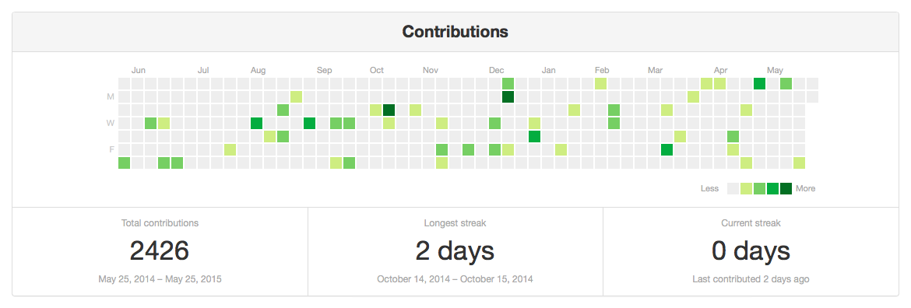
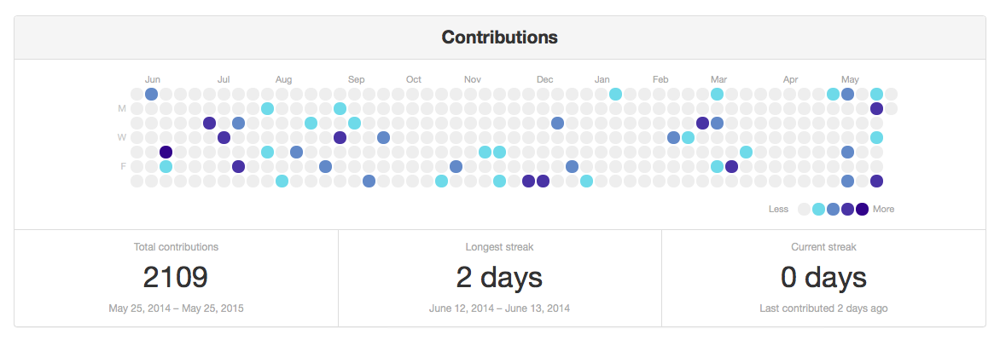
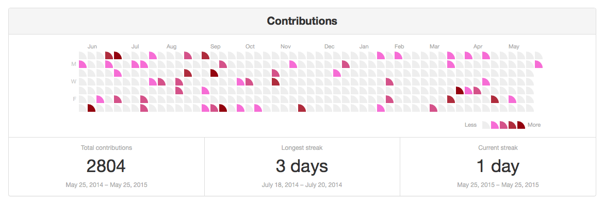

# contribution-graph

This is a clone of the Contributions chart from the GitHub user page, written in Python.

This is what it looks like with the default settings:



I wrote it so that I could use the GitHub design for other things I want to track, including exercise and reading.

The original graph was [introduced by GitHub in 2013](https://github.com/blog/1360-introducing-contributions). I don't know whose idea it was; I just copied the design and built my own version of it.

## Installation

Clone this repository onto your computer:

```none
git clone git@github.com:alexwlchan/contributions-graph.git
cd contributions-graph
```

Install the Python dependencies (I recommend doing this inside a [virtualenv](https://pypi.python.org/pypi/virtualenv)):

```none
pip install -r requirements.txt
```

You also need to build the style sheets. This [uses Sass](http://sass-lang.com):

```none
sass --scss contributions/static/style.scss:contributions/static/style.css
```

If you don't want to or can't install Sass, you can also use an online converter, such as [Sassmeister](http://sassmeister.com).

It should run on Python 2 or 3, although I've only tested it on 2.7.

## Usage

Create a text file that records each day, with the number of contributions for that day, with a space between the date and the value:

    YYYY-MM-DD value

Other notes:

*   As with Python source code, anything after a `#` is ignored and treated as a comment.
*   One date/value pair per line.
*   Blank lines are fine.

I've included an example file in the repo: `example.txt`.

Now use the `create_graph()` function, supplying the name of this text file, and you get the HTML for a simple page with the contributions graph:

```python
from contributions.render_html import create_graph
print create_graph("example.txt")
```

If you have multiple such files, supplying them as a list to this function will put all the graphs on the same page:

```python
from contributions.render_html import create_graph
print create_graph(["example1.txt", "example2.txt"])
```

This should work on Python 2 and 3, but I've only tested it in Python 2.7.

## Todo list

Here are some ideas I have for the future:

*   More colours and shapes. Since each cell is just a `<div>`, it should be  fairly easy to recolour and reshape.

    Here are a few that I came up with by just tweaking the CSS by hand:

    

    

    It would be nice for those to be available as options rather than by hand-tweaking.

*   A mobile version. The short and wide version doesn't really work on small screens, but I think this design *might* work if you rotated through 90 degrees. Weeks along the top, months down the side.

    I want to give that a go.

*   Unit tests are awesome. I should write more of them.

*   The ability to customise some of the text. Right now, it only says "Contributions". It would be nice to be able to put other words in as appropriate.

*   More statistics options. I just took the three stats that GitHub offers, but there may be different ones that are useful.

    (For example, a graph of steps walked doesn't really have much use for longest/current streak, but might want average daily steps.)

*   Skippable weekends? I think it might be useful to use this for some work-related tasks, but since I don't work weekends, there would be a bunch of blank boxes. It might be nice to have an option for omitting weekends.

*   Squash the bugs! Since this project involves a lot of fiddly stuff with calendars and dates, it's almost certain that somewhere, someday, something will go wrong. I'd like to do some more testing to find out if/where that's going to be.