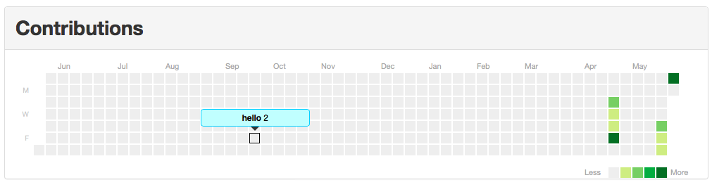

# contribution-graph

This is a clone of the Contributions chart from the GitHub user page, written in Python.

It's very much a work-in-progress.

Still to do:

* Tooltips that reflect a day's contributions
* Colours!
* Those stat panels (total contributions, longest streak, current streak)
* Tidy up the code
* Write a README
